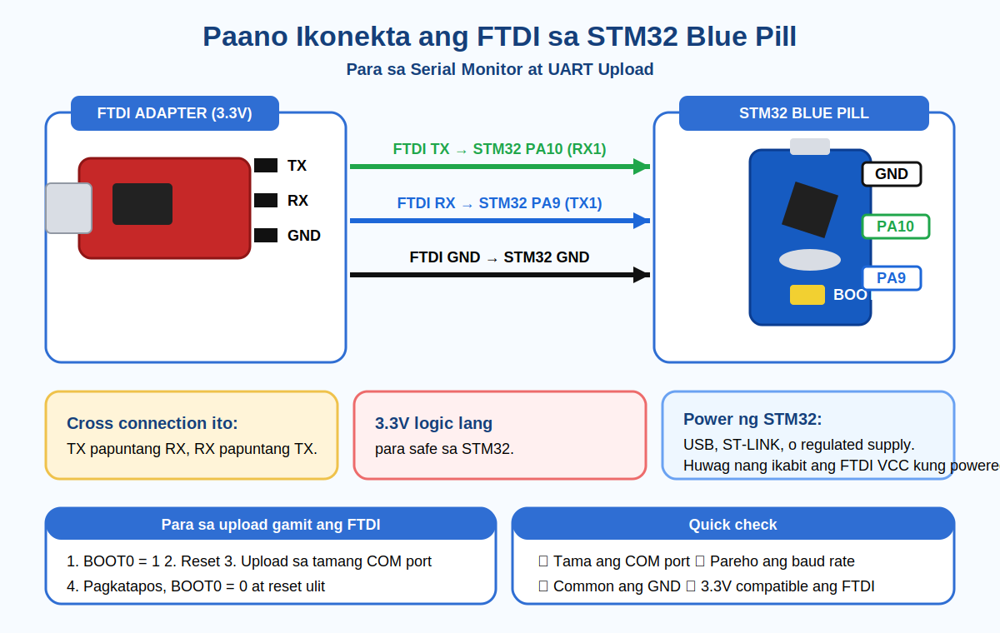

# Paano Ikonekta ang FTDI sa STM32 Blue Pill

Kung gusto mo ng **Serial Monitor** sa STM32 Blue Pill, o gusto mong mag-upload gamit ang **UART bootloader**, ito ang basic at safe na setup.

## Wiring picture



## Basic connection

Gagamitin natin ang **USART1** ng STM32 Blue Pill.

| FTDI | STM32 Blue Pill | Gamit |
|---|---|---|
| TX | PA10 (RX1) | Serial data |
| RX | PA9 (TX1) | Serial data |
| GND | GND | Common ground |
| 3.3V / VCC | 3.3V | Optional power lang |

### Tandaan

Cross connection ang serial pins:

```text
FTDI TX   -> STM32 RX / PA10
FTDI RX   -> STM32 TX / PA9
FTDI GND  -> STM32 GND
FTDI 3.3V -> STM32 3.3V   (optional power)
```

Hindi **TX to TX** at hindi rin **RX to RX**.

## Kailan ikakabit ang 3.3V?

Ikabit lang ito:

```text
FTDI 3.3V -> STM32 3.3V
```

kapag ang **FTDI mismo ang gagamitin mong power source** ng Blue Pill.

### Important

- Siguraduhing tunay na **3.3V output** ang VCC pin ng FTDI.
- Huwag ikabit ang FTDI VCC sa **5V pin** ng STM32.
- Kapag FTDI 3.3V ang nagpapower sa STM32, huwag nang sabayan ng USB, ST-LINK power, o ibang supply.
- Kapag powered na ang STM32 gamit ang USB, ST-LINK, o regulated supply, huwag nang ikabit ang FTDI 3.3V/VCC.
- Kahit hindi konektado ang VCC, kailangan pa rin na common ang GND.

## Para sa Serial Monitor / debugging

Kung powered na ang STM32 gamit ang USB o ST-LINK, ito lang ang kailangan:

```text
FTDI TX  -> PA10
FTDI RX  -> PA9
FTDI GND -> GND
BOOT0    -> 0
```

Kung FTDI ang magpapower sa board, idagdag:

```text
FTDI 3.3V -> STM32 3.3V
```

### Sample code

```cpp
void setup() {
  Serial1.begin(115200);
}

void loop() {
  Serial1.println("Hello from STM32");
  delay(1000);
}
```

Sa Arduino IDE Serial Monitor, itapat sa:

```text
115200 baud
```

## Para sa upload gamit ang FTDI

Kapag UART upload ang gagamitin natin:

### Wiring

```text
FTDI TX  -> PA10
FTDI RX  -> PA9
FTDI GND -> GND
```

Optional power:

```text
FTDI 3.3V -> STM32 3.3V
```

Huwag na itong ikabit kapag may ibang power source na ang STM32.

### Boot setting

Bago mag-upload:

```text
BOOT0 = 1
```

Pagkatapos:

1. Ilagay ang **BOOT0 sa 1**.
2. Pindutin ang **RESET** ng STM32.
3. Sa Arduino IDE, piliin ang tamang STM32 board.
4. Piliin ang serial/UART upload method na available para sa board.
5. Piliin ang tamang COM port ng FTDI.
6. Click **Upload**.

Kapag successful na ang upload:

1. Ibalik ang **BOOT0 sa 0**.
2. Pindutin ulit ang **RESET**.
3. Okay na, tatakbo na ang program natin.

## Kapag walang lumalabas sa Serial Monitor

Check muna ito:

- tama ba ang COM port
- pareho ba ang baud rate
- crossed ba ang TX at RX
- common ba ang GND
- `Serial1` ba ang gamit sa code
- naka-3.3V logic ba ang FTDI
- may stable power ba ang STM32

## Kapag upload failed

Check muna ito:

- naka-**BOOT0 = 1** ba bago mag-upload
- na-reset ba ang board
- tama ba ang COM port
- tama ba ang upload method
- may ibang app bang gumagamit ng COM port
- maayos ba ang TX, RX, at GND wiring
- kung FTDI ang power source, nakakabit ba ang **3.3V to 3.3V**

## Mabilis na summary

Kapag may sariling power na ang STM32:

```text
FTDI TX  -> PA10
FTDI RX  -> PA9
FTDI GND -> GND
FTDI VCC -> huwag ikabit
```

Kapag FTDI ang magpapower sa STM32:

```text
FTDI TX   -> PA10
FTDI RX   -> PA9
FTDI GND  -> GND
FTDI 3.3V -> STM32 3.3V
```

Para sa UART upload:

```text
BOOT0 = 1
RESET
UPLOAD

pagkatapos:
BOOT0 = 0
RESET ulit
```

## Tip

Kapag ayaw gumana, ito agad ang unang tingnan natin:

- baliktad ba ang TX at RX
- common ba ang GND
- tama ba ang COM port at baud rate
- 3.3V ba talaga ang FTDI
- isa lang ba ang nagpapower sa STM32

Simple lang ang setup, pero dito madalas nanggagaling ang problema kapag walang serial output o ayaw mag-upload.